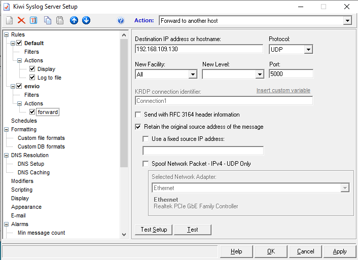

# INSTALACION VM DEBIAN CON SPLUNK Y GESTIÓN DE LOGS DE MÁQUINAS CREADAS EN GNS3

## SPLUNK

Splunk es un software para buscar, monitorizar y analizar macrodatos generados por máquinas de aplicaciones, sistemas e infraestructura IT a través de una interfaz web. Lo primero que debemos hacer es descargarlo e instalarlo en una máquina Linux, en este caso Debian:

~~~
wget -O splunk-8.0.6-152fb4b2bb96-linux-2.6-amd64.deb 'https://www.splunk.com/bin/splunk/DownloadActivityServlet?architecture=x86_64&platform=linux&version=8.0.6&product=splunk&filename=splunk-8.0.6-152fb4b2bb96-linux-2.6-amd64.deb&wget=true'
sudo dpkg -i splunk-8.0.6-152fb4b2bb96-linux-2.6-amd64.deb
~~~

Tras esto, iniciamos Splunk:

~~~
cd /opt/splunk/bin/
sudo ./splunk start
~~~

Y ya podremos acceder mediante el navegador indicando la IP y el puerto 8000.

## GNS3

GNS3 es un simulador gráfico que permite diseñar topologías de red complejas y realizar simulaciones. Lo primero que vamos a hacer es descargarlo de la página oficial e instalarlo en nuestra máquina anfitriona Windows. Es importante elegir la opción de virtualización VMWare.

Tras esto, vamos a crear un nuevo proyecto y realizar la instalación de las máquinas que deseemos; en este caso Cisco, Mikrotik, Vyos y Ubuntu. Para esta instalación solo debemos seleccionar File > New Templates > Install an appliance from the GNS3 server.

Finalmente, vamos a conectar todas las máquinas a una red para que puedan transmitir la información para los logs.

Para ello, vamos a crear una interfaz loopback en nuestra máquina anfitriona; para luego poder crearla en GNS3 y conectarla con las demás máquinas creadas con anterioridad.

## KIWI SYSLOG

Kiwi Syslog nos va a permitir recoger y mostrar los datos de GNS3 para enviarlos a Splunk. Lo primero que vamos a hacer es descargarlo e instalarlo en nuestra máquina anfitriona Windows.

Tras esto, vamos a configurar que Kiwi envíe a nuestro servidor Splunk los syslogs recolectados por el puerto que queramos, en este caso el 5000.

## SYSLOG-NG

Syslog-ng es un programa de recolección de datos con el que podremos obtener los datos de Kiwi y enviarlos a un fichero. Lo primero que debemos hacer es descargarlo e instalarlo en nuestra máquina Linux en la que habíamos instalado Splunk con anterioridad:

~~~
sudo apt install syslog-ng
~~~

Tras esto vamos a configurarlo:

~~~
nano /etc/syslog-ng/syslog-ng.conf

@version: 3.5
@include "scl.conf"
@include "`scl-root`/system/tty10.conf"
    options {
        time-reap(30);
        mark-freq(10);
        keep-hostname(yes);
        };
    source s_local { system(); internal(); };
    source s_network {
        syslog(transport(udp) port(5000));
        };
    filter f_mikrotik { host( "192.168.109.1" ); };
    log { source ( s_network ); filter( f_mikrotik ); destination ( df_mikrotik ); };
    destination df_mikrotik {
    file("/var/log/syslog-ng/${HOST}.${YEAR}.${MONTH}.${DAY}.log"
    template-escape(no)); };
~~~

Ahora reiniciamos el servicio y comprobamos que vemos los logs perfectamente en el siguiente archivo:

~~~
cat /var/log/syslog-ng/192.168.109.1.2020.09.30.log

...
Sep 30 19:46:04 192.168.109.1 Original Address=192.168.137.3 Sep 30 17:46:02 gns3 org.gnome.Shell.desktop[1592]: #33 0x7ffc42715cc0 b   resource:///org/gnome/gjs/modules/_legacy.js:82 (0x7efc640b5de0 @ 71)
Sep 30 19:46:04 192.168.109.1 Original Address=192.168.137.3 Sep 30 17:46:02 gns3 org.gnome.Shell.desktop[1592]: #34 0x55c0d13d6e30 i   resource:///org/gnome/shell/ui/tweener.js:219 (0x7efc640cf780 @ 15)
~~~

## MÁQUINA CISCO

Vamos a configurar la IP, hacemos logging y un ping:

~~~
R1#conf t
Enter configuration commands, one per line.  End with CNTL/Z.
R1(config)#interface f0/0
R1(config-if)#exit
R1(config)#interface fa0/0
R1(config-if)#ip add 192.168.137.2 255.255.255.0
R1(config-if)#no shutdown
R1(config-if)#exit
R1(config)#logging host
*Oct 13 11:01:47.095: %LINK-3-UPDOWN: Interface FastEthernet0/0, changed state to up
*Oct 13 11:01:48.095: %LINEPROTO-5-UPDOWN: Line protocol on Interface FastEthernet0/0, changed state to up
R1(config)#logging host 192.168.137.1
R1(config)#logging trap 7
R1(config)#exit
R1#
*Oct 13 11:02:05.391: %SYS-5-CONFIG_I: Configured from console by console
R1#de
*Oct 13 11:02:06.391: %SYS-6-LOGGINGHOST_STARTSTOP: Logging to host 192.168.137.1 port 514 started - CLI initiated
R1#debug ip icmp
ICMP packet debugging is on
R1#ping 192.168.137.1

Type escape sequence to abort.
Sending 5, 100-byte ICMP Echos to 192.168.137.1, timeout is 2 seconds:
!!!!!
Success rate is 100 percent (5/5), round-trip min/avg/max = 8/10/12 ms
R1#
*Oct 13 11:02:20.599: ICMP: echo reply rcvd, src 192.168.137.1, dst 192.168.137.2
*Oct 13 11:02:20.607: ICMP: echo reply rcvd, src 192.168.137.1, dst 192.168.137.2
*Oct 13 11:02:20.619: ICMP: echo reply rcvd, src 192.168.137.1, dst 192.168.137.2
*Oct 13 11:02:20.631: ICMP: echo reply rcvd, src 192.168.137.1, dst 192.168.137.2
*Oct 13 11:02:20.643: ICMP: echo reply rcvd, src 192.168.137.1, dst 192.168.137.2
R1#
~~~

## MÁQUINA MIKROTIK

Vamos a configurar la IP y hacemos logging:

~~~
[admin@MikroTik] > ip address
[admin@MikroTik] /ip address> add address=192.168.137.3/24 interface=ether1
failure: already have such address
[admin@MikroTik] > ip route
[admin@MikroTik] /ip route> add gateway=192.168.137.1
[admin@MikroTik] > /system logging action
[admin@MikroTik] /system logging action> set 3 remote=192.168.137.1
[admin@MikroTik] /system logging action> add name=ZLogServer remote=192.168.137.1 target=remote
failure: action already exists with such a name
[admin@MikroTik] /system logging action> /system logging
[admin@MikroTik] /system logging> add action=ZLogServer topics=pppoe,ppp,info
[admin@MikroTik] /system logging> add action=ZLogServer topics=system,info
~~~

## MÁQUINA VYOS

Vamos a configurar la IP y hacemos logging:

~~~
vyos@vyos:~$ ip a add 192.168.137.4/24 dev eth0
vyos@vyos:~$ ip l set eth0 up
vyos@vyos:~$ ip a
1: lo: <LOOPBACK,UP,LOWER_UP> mtu 65536 qdisc noqueue state UNKNOWN group default
    link/loopback 00:00:00:00:00:00 brd 00:00:00:00:00:00
    inet 127.0.0.1/8 scope host lo
       valid_lft forever preferred_lft forever
    inet6 ::1/128 scope host
       valid_lft forever preferred_lft forever
2: eth0: <BROADCAST,MULTICAST,UP,LOWER_UP> mtu 1500 qdisc pfifo_fast state UP group default qlen 1000
    link/ether 0c:7d:cb:13:6d:00 brd ff:ff:ff:ff:ff:ff
    inet 192.168.137.4/24 scope global eth0
       valid_lft forever preferred_lft forever
    inet6 fe80::e7d:cbff:fe13:6d00/64 scope link
       valid_lft forever preferred_lft forever
3: eth1: <NO-CARRIER,BROADCAST,MULTICAST,UP> mtu 1500 qdisc pfifo_fast state DOWN group default qlen 1000
    link/ether 0c:7d:cb:13:6d:01 brd ff:ff:ff:ff:ff:ff
4: eth2: <NO-CARRIER,BROADCAST,MULTICAST,UP> mtu 1500 qdisc pfifo_fast state DOWN group default qlen 1000
    link/ether 0c:7d:cb:13:6d:02 brd ff:ff:ff:ff:ff:ff
vyos@vyos:~$ configure
[edit]
vyos@vyos# set system syslog host 192.168.137.1 facility all level info
[edit]
vyos@vyos# set system syslog host 192.168.137.1 facility mark level info
[edit]
vyos@vyos# save
Warning: you have uncommitted changes that will not be saved.

Saving configuration to '/config/config.boot'...
Done
[edit]
vyos@vyos# commit
[ system syslog ]
Stopping enhanced syslogd: rsyslogd.
Starting enhanced syslogd: rsyslogd.

[edit]
~~~

## MÁQUINA UBUNTU

Vamos a configurar la IP, configurar un fichero y reiniciar el servicio:

~~~
gns3@gns3:~# sudo ip a add 192.168.137.5/24 dev ens3
gns3@gns3:~# sudo ip l set ens3 up
gns3@gns3:~# sudo nano /etc/rsyslog.d/50-default.conf
...
*.* @192.168.137.1:514
gns3@gns3:~# sudo systemctl restart rsyslog
~~~